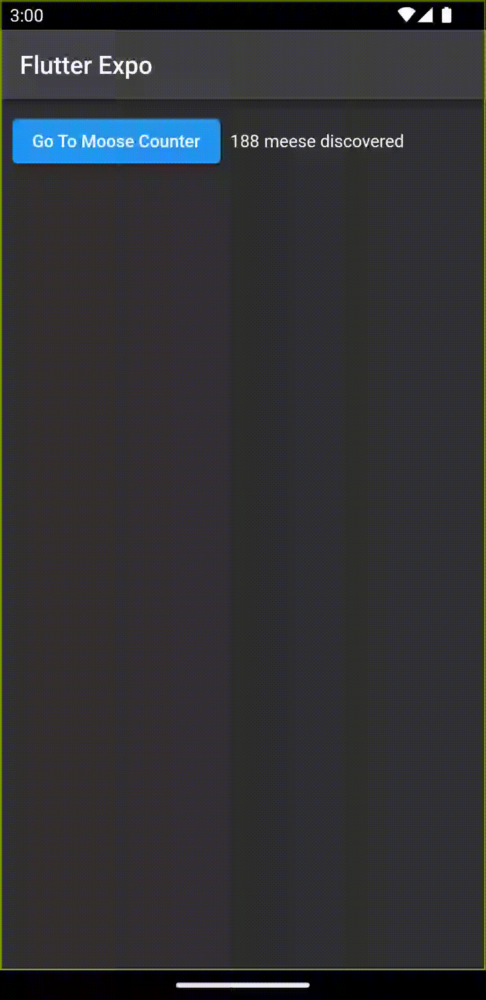

# flutter_sharedpreferences_notifier

A Flutter project showing how to use SharedPreferences and Provider/ChangeNotifier together.




## Getting Started

The real magic here is this class that you can take and use in your own projects. 

Easily persist values across app restarts and update all uses of a value.

First, you will need to initialize SharedNotifier in your `main`

```dart
Future<void> main() async {
  WidgetsFlutterBinding.ensureInitialized();
  await SharedNotifier().init();
  runApp(const StatelessApp());
}
```

You can use it easily like this

```dart
  // Top level widget
  // wrap your tree in MultiProvider/Provider
  @override
  Widget build(BuildContext context) {
    return MultiProvider(
      providers: [
        ChangeNotifierProvider.value(
          value: SharedNotifier(),
        ),
      ],
      child: Widget(...),
    )
  }
```

```dart
// Use and watch a value from SharedPreferences with live updates
var counter = Provider.of<SharedNotifier>(context).getInt('counter');
```

```dart
// Store a value in SharedPreferences and update all watchers
Provider.of<SharedNotifier>(context, listen: false)
    .setInt('counter', 42);
```

### methods
```dart
bool getBool(String key) 
Future<bool?> setBool(String key, bool value)

int getInt(String key) 
Future<bool?> setInt(String key, int value)

double getDouble(String key) 
Future<bool?> setDouble(String key, double value)

String getString(String key) 
Future<bool?> setString(String key, String value)

List<String> getStringList(String key) 
Future<bool?> setStringList(String key, List<String> value)

```

## SharedNotifier class
  
```dart
# lib/util/shared_notifier.dart
import 'package:shared_preferences/shared_preferences.dart';
import 'package:flutter/material.dart';
class SharedNotifier extends ChangeNotifier {
    static late SharedPreferences _sharedPrefs;
    SharedNotifier({Key? key});
    Future<void> init() async {
        _sharedPrefs = await SharedPreferences.getInstance  ();
    }
    bool? getBool(String key) {
        return _sharedPrefs.getBool(key);
    }
    int? getInt(String key) {
        return _sharedPrefs.getInt(key);
    }
    double? getDouble(String key) {
        return _sharedPrefs.getDouble(key);
    }
    String? getString(String key) {
        return _sharedPrefs.getString(key);
    }
    List<String>? getStringList(String key) {
        return _sharedPrefs.getStringList(key);
    }
    Future<bool?> setBool(String key, bool value) {
        var ret = _sharedPrefs.setBool(key, value);
        notifyListeners();
        return ret;
    }
    Future<bool?> setInt(String key, int value) {
        var ret = _sharedPrefs.setInt(key, value);
        notifyListeners();
        return ret;
    }
    Future<bool?> setDouble(String key, doublevalue) {
        var ret = _sharedPrefs.setDouble(key, value);
        notifyListeners();
        return ret;
    }
    Future<bool?> setString(String key, Stringvalue) {
        var ret = _sharedPrefs.setString(key, value);
        notifyListeners();
        return ret;
    }
    Future<bool?> setStringList(String key,List<String>     value) {
        var ret = _sharedPrefs.setStringList(key, value);
        notifyListeners();
        return ret;
    }
    void set(String key, dynamic value) {
        debugPrint("Saving $key as $value");
        switch (value.runtimeType) {
        case bool:
            setBool(key, value);
            break;
        case int:
            setInt(key, value);
            break;
        case double:
            setDouble(key, value);
            break;
        case String:
            setString(key, value);
            break;
        case List<String>:
            setStringList(key, value);
            break;
        default:
            // Just in case, tell everyone to update.
            notifyListeners();
        }
    }
}
```